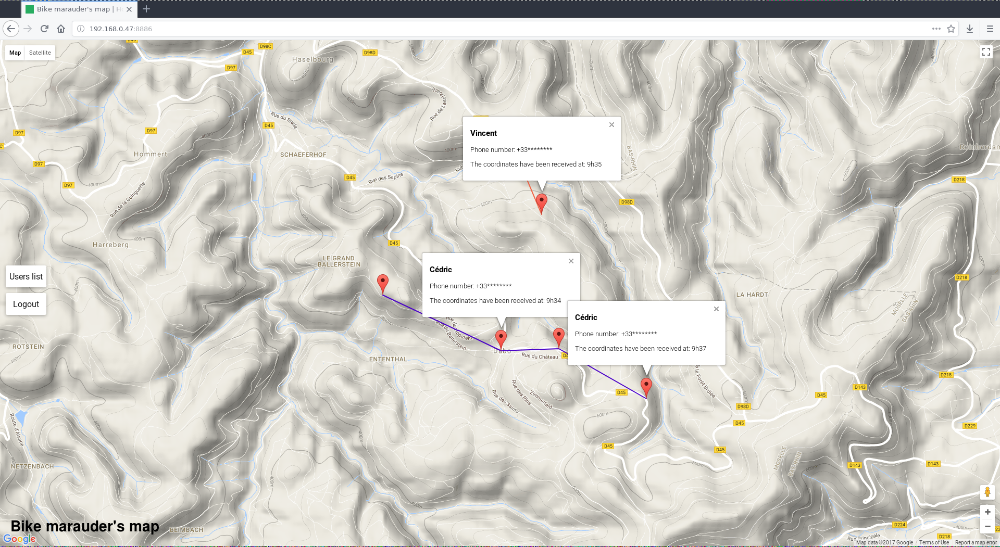
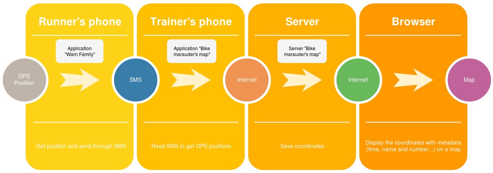

# Bike marauder's map

A map to display the position of friends during a bike contest for exemple.

Before starting server please define the `google_maps_api_key` and the `hashsecret` in the *configuration.json* file:

```json
{
  "hashsecret": "76656f89f7b54307931c849b5bfbf372",
  "google_maps_api_key": "AIerzaSyADONmOK9SBsOAY1q_Px4p2-0nixiwaKc",
  "users": []
}
```

You can get a Google Maps API key [there](https://developers.google.com/maps/documentation/javascript/get-api-key).



## How does it works ? 

1. Send SMS with coordinates thanks [Warn Family](https://github.com/cedced19/warn-family) on a Phone A
2. Get the SMS on a Phone B
3. Read them with [Bike marauder's map application](https://github.com/cedced19/bike-marauder-s-map-mobile)
4. Send them to the server
5. See the map in your browser like this one:

